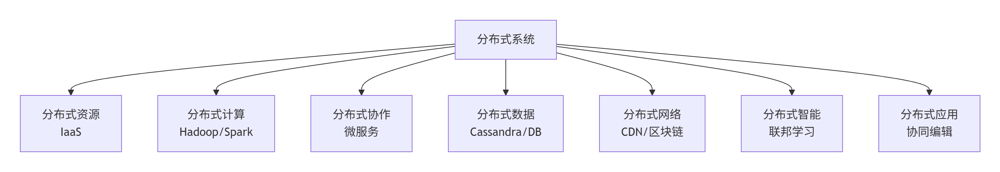
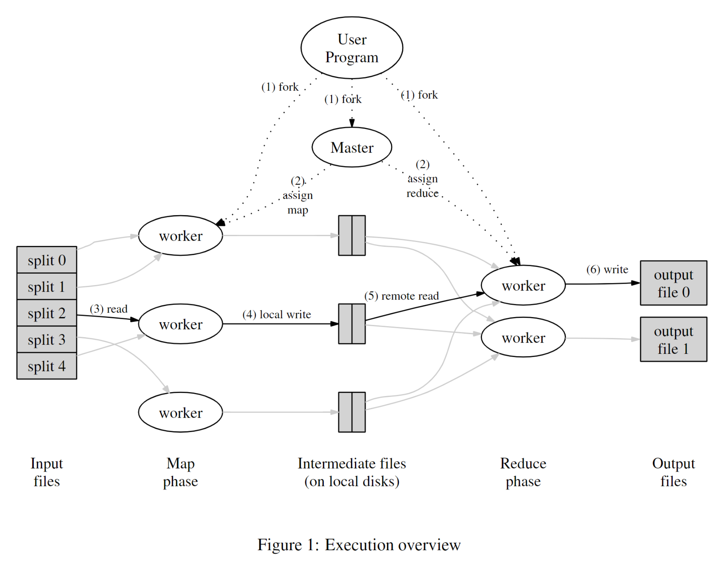
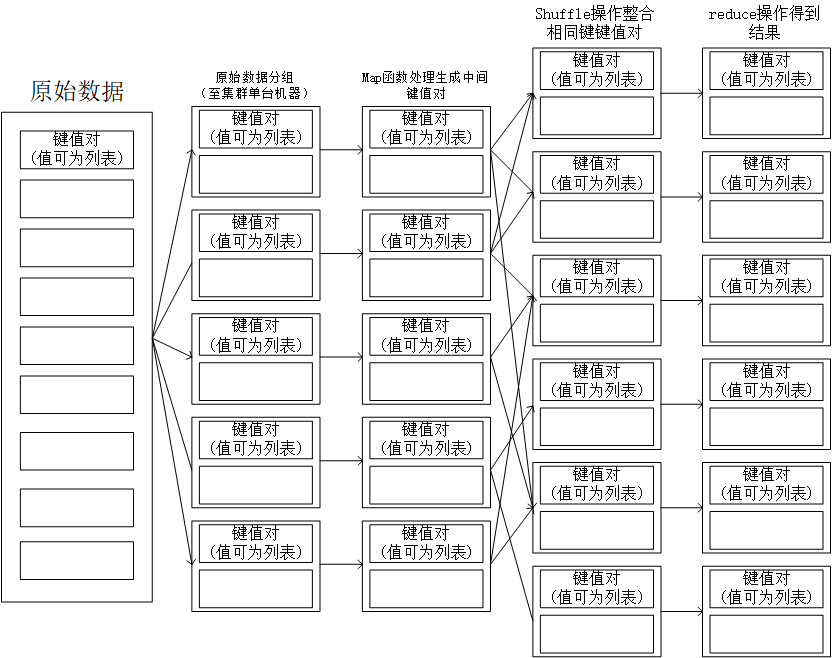
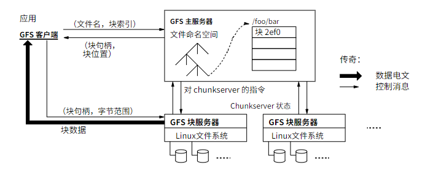
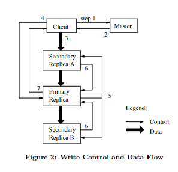

# 6.5840 分布式系统
## Lecture 0
### 分布式系统概念
一个分布式系统是由多个独立的计算机（通常称为节点，Node）​​ 组成的集合，这些节点通过网络连接和消息传递进行通信与协调，从而对外作为一个统一的、连贯的系统提供服务或完成共同的任务。
### 分布式系统内涵

分布式系统的世界远不止于“计算”。它是一个丰富的工具箱，提供了各种模式来解决不同维度的问题：
​解决资源问题​：用 ​分布式资源（IaaS）​​
​解决算力问题​：用 ​分布式计算（Hadoop）​​
​解决复杂度问题​：用 ​分布式协作（微服务）​​
​解决数据存储规模问题​：用 ​分布式数据（Database）​​
​解决网络效率与信任问题​：用 ​分布式网络（CDN/区块链）​​
​解决AI数据隐私和规模问题​：用 ​分布式智能（联邦学习，大模型分布式训练，分布式推理）​​
​解决多用户互动问题​：用 ​分布式应用（协作工具/游戏）​​
所有这些都共享着分布式系统的核心思想：​通过消息传递，让多个独立的组件协同工作，从而达成一个共同的目标，并以此获得单机系统无法比拟的优势。
#### KVM等虚拟化技术在此体系中的地位
KVM等虚拟化技术可将物理主机一虚多，主要用于提供虚拟化的服务器节点（服务器节点可组成分布式系统）。使用这种虚拟化技术管理，可以解决分布式资源的问题。
#### k8s在此体系中的地位
k8s不属于上述任何一个维度，k8s是一个使用分布式的资源（服务器node集群提供的分布式资源，其中服务器node集群可以是物理机，也可以是IaaS提供的虚拟机集群）构建分布式系统（由多个pod组成的分布式系统）的管理平台。
#### 分而治之
分而治之是分布式系统的核心思想，它将一个复杂的问题分解为多个简单的问题，每个问题都可以在分布式系统中的一个节点上解决。分了之后将分得到的结果合起来作为结果提供。
在分布式资源中，每个节点分开执行虚拟化操作，将虚拟化之后的资源合成大资源池，为用户提供分布式系统貌似整体的服务。最后以虚拟机的形式为用户提供主机节点。从这个角度来看，KVM等虚拟化技术可以被看作一种分布式资源。
分布式网络，将用户复杂的网络资源请求，分散到不同的节点上，每个节点负责处理一部分请求。最后将每个节点处理的结果合并起来，提供给用户。
分布式计算，将用户复杂的计算任务，分散到不同的节点上，每个节点负责处理一部分任务。最后将每个节点处理的结果合并起来，提供给用户。
## Lecture 1 
### 1. MapReduce分布式计算框架
Hadoop 是一个使用分布式系统实现分布式计算的框架。是使用 Java 编写，允许分布在集群，使用简单的编程模型的计算机大型数据集处理的Apache 的开源框架。其主要的计算框架是 MapReduce。
MapReduce 是一个分布式运算程序的编程框架，是用户开发“基于 Hadoop 的数据分析应用”的核心框架。 MapReduce 核心功能是将用户编写的业务逻辑代码和自带默认组件整合成一个完整的分布式运算程序，并发运行在一个 Hadoop 集群上。
#### 用户角度
用户角度需要实现map与reduce两个函数。
map函数：将输入的key-value对映射为中间的key-value对列表。
reduce函数：将具有相同key的中间的key-value对列表归并为输出的key-value对。
在map函数中，输入的键值对为原始数据，中间键值对是map函数对原始数据进行了一定的计算，并对计算结果进行了分类。其中分类就是中间键值对的键。分类指定该计算结果由哪一个reduce函数处理。
在reduce函数中，输入的键值对列表是map函数输出的中间键值对列表中，键相同的那些键值对。reduce函数需要将这些键值对进行归并，输出为最终的键值对。最终的键值对的键，也是map函数分类产生的键。（因为reduce函数会对每一个map出的类生成一个结果。）
上述论证意味着，mapreduce框架的设计过程为：
1. 将大段的、无头绪的数据转化为一条一条的记录。（如大量文本转化为一条一条的词频，大量请求记录转化为一条一条的请求记录）
2. 其中一条一条的概念是指每一个中间键值对的组（以键分组）生成一条数据。
3. map函数用于从原始数据得到中间键值对。
4. reduce函数用于从中间键值对列表得到最终的键值对。
#### mapreduce开发人员角度

要实现一个可用的 MapReduce 框架，需要设计和实现以下几个核心组件：
##### ​Master/JobTracker（作业调度与资源管理）​​
这是框架的大脑，负责全局管理。你需要实现：
​作业管理​：接收客户端提交的作业，将其分解为具体的 Map 任务和 Reduce 任务。
​任务调度​：监控各个 Worker（TaskTracker）的状态，将任务分配给空闲的 Worker，并尽可能遵循数据本地化原则，即优先将任务分配给存有对应数据块的 Worker，以减少网络传输。
​容错处理​：通过心跳机制监控 Worker 的健康状态。如果某个 Worker 失效，Master 需要将其负责的任务重新调度到其他健康的 Worker 上执行。
##### ​Worker/TaskTracker（任务执行器）​​
这是框架的四肢，负责执行具体的计算任务。每个 Worker 需要：
​汇报状态​：定期向 Master 发送心跳，报告自身状态和任务执行进度。
​执行任务​：根据 Master 的指令，启动独立的进程或线程来执行 Map 任务或 Reduce 任务。
​数据管理​：Map 任务会从分布式文件系统（如 HDFS）读取输入数据分片；Reduce 任务将最终结果写回分布式文件系统。
##### 编程模型接口​
为了让用户能够定义业务逻辑，你需要提供清晰的编程接口：
​Mapper 接口​：用户继承此类并实现 map方法，处理输入的键值对并生成中间结果。
​Reducer 接口​：用户继承此类并实现 reduce方法，对属于同一个 key 的所有中间值进行聚合。
##### 关键流程与技术难点
在实现上述组件时，​Shuffle​ 阶段是最复杂也是最核心的部分，它连接了 Map 和 Reduce，具体包括：
​Map 端 Shuffle​：
​分区（Partitioning）​​：Map 输出的每个键值对会根据一个分区函数（默认是 Hash 分区）确定它属于哪个 Reduce 任务。
​排序（Sorting）​​：每个分区内的数据会按照 key 进行排序，为后续 Reduce 端的归并做准备。
​合并（Combiner）​​：这是一个可选的本地聚合优化，在 Map 端先对中间结果进行一次合并，可以显著减少网络传输的数据量。
​Reduce 端 Shuffle​：
​数据拉取（Fetch）​​：Reduce 任务启动线程，从各个已完成 Map 任务的节点上拉取属于自己分区的数据。
​归并排序（Merge Sort）​​：由于数据来自多个 Map 任务，Reduce 任务需要将这些数据文件进行归并，最终形成一个有序的大文件，然后才开始执行用户定义的 Reduce 函数。
### MapReduce: Simplified Data Processing on Large Clusters论文阅读
#### 摘要
MapReduce是一种编程模型，用于处理大型数据集。用户指定一个映射函数，该函数处理输入键值对生成一组中间键值对，指定一规约函数，合并所有与同一中间键相关联的中间值，生成最终的键值对。
使用这种风格编写的呈现会自动并行化，在大量的集群机器上并行执行，最后合并结果。
#### 简介
map实现的是将输入数据对应输出数据进行分组，reduce实现处理分组后的数据得到对应的结果。
1. 第二节描述了基本的编程模型。
2. 第三节介绍针对特定集群环境定制的MapReduce接口实现。
3. 第四节描述了认为有用的编程模型的改进。
4. 第五节描述了针对各种任务实现的性能测量结果。
5. 第六节描述了MapReduce在谷歌内部的使用。
6. 第七节讨论了相关工作与未来工作。
#### 编程模型
MapReduce解决的问题为由一个键值对序列生成另一个键值对序列。
举例（统计单词出现的次数）：由[(文件名1，文件内容1)，(文件名2，文件内容2)……]----->[(单词1，出现次数1)，(单词2，出现次数2)……]
map函数的功能为将输入的键值对映射为中间键值对。
reduce函数的功能为将中间键值对列表归并为最终的键值对。
其过程如下图：

#### 实施
MapReduce接口由多种实现方式，正确选择实现方式取决于环境。
论文举三例：
1. 适用于小型共享内存。
2. 适用于大型非同一内存访问（NUMA）多处理器。
3. 适用于大规模的联网集群集群。
详细描述了针对谷歌广泛使用的大规模联网机器集群的MapReduce实现。
##### 该MapReduce程序执行过程
1. 将输入文件分割为M个大小通常为64MB的输入分片。
2. 在一组机器上启动多个数据Mapreduce程序副本。
3. 在这些程序副本中，有一份副本比较特殊，称为主节点副本，其余的节点为工作节点，主节点会在工作节点上分配M个Map任务和R个reduce任务。主节点挑选空闲的工作节点，并为每一个工作节点分配一个映射任务或者一个归约任务。
4. 映射任务的工作节点会读取数据分片，解析成所有传递给自己的键值对，然后调用用户定义的Map函数，生成中间值键值对，此时生成的中间值键值对会在内存中缓冲。
5. 缓冲区中的中间键值对会被定期写入本机磁盘中（本机磁盘属于分布式存储系统的成员）。本机会将磁盘中的中间键值对基于键划分为R个区域，对应R个归约任务。这R个区域在磁盘中的位置会被汇报给主节点，主节点会将这些位置信息发送给对应的归约任务。
6. 当一个归约工作节点从主节点收到这些数据的位置时，会通过远程过程调用的形式从对应的Map工作节点上拉取所有属于自己的数据块，当一个归约节点拉去到自己所有的数据后，会按照中间键对其进行排序（不同中间键可能会被映射到同一个归约节点，排序可以让相同的键归为一组）。
7. 归约工作进程会对排列后的中间数据进行迭代，对于每一个唯一的中间键，会将该键与中间值序列传入归约函数。函数输出会被最佳到此归约分区的最终输出文件中。
8. 所有任务完成后会返回。
##### 执行过程中所需数据结构
1. 每个Map任务与Reduce任务的状态。
2. 每个工作节点具体的身份，是哪一个Map或哪一个Reduce。
3. 主节点是映射任务结果传递到规约任务的通路，因此主节点维护着每一个映射认为R个中间文件区域的位置与大小，当Map任务完成后，会通知主节点更新中间文件区域位置与大小信息，然后会将更新后的信息结构体推送给归约任务。
##### 容错性设计
###### 工作节点故障：
1. 节点故障的判定：工作节点会周期性的给主节点发送心跳信号，如果主节点在一定时间内没有收到工作节点的心跳信号，就会将该工作节点判定为故障节点。
2. 此时工作节点上已经完成的Map任务会被重置为空闲，使得其可以被重新调度。因为Map任务的结果存储于本地磁盘，当工作节点故障时，这些结果会丢失。此后执行规约任务的节点都会被定向到新的Map节点读取Map的结果。
3. 此时工作节点上已经完成的归约任务不会受到影响，因为归约任务的结果作为输出存储在全局文件系统中，不会因为一个节点的故障造成输出结果的丢失。
4. 正在执行的任何映射任务与归约任务都会被重置为空闲状态，等待重新调度。
###### 主节点故障：
1. 如果主节点出现故障，将停止MapReduce的计算，用户可以查看到这种情况如有必要，可以重启MapReduce计算。
2. 主节点的错误处理可以通过主节点定期记录主节点中的数据结构实现，便于根据检查点重启主节点。
###### 故障存在的语义学：
1. 当用户提供的映射函数与归约函数是输入值的确定性函数时，存在错误与不存在错误，整个系统产生的结果是相同的。
2. 系统通过原子提交的方式实现这个特性，每一个任务都会且仅会提交一个任务结果。Map任务在运行时持有R个私有数据结果，在Map任务完全完成后，会将这R个数据区的信息传递给Master节点。Reduce任务在运行时会持有1个私有数据结果，在Reduce任务完全完成后，会将这个数据结果存储进入分布式的数据存储系统中。
##### 本地性
鉴于网络带宽的稀缺性，MapReduce程序在执行时，会尽可能地将数据本地化处理，即尽可能地将数据处理在数据所在的机器上，而不是将数据传输到处理节点上。这一特性采用了GFS的文件分布策略，该分布式文件系统将文件分为64Mb的快，并在不同的机器上存储每一个块的多个副本，通常为三个副本。Master节点在进行任务调度时，会考虑到文件位置信息，将任务调度到数据所在节点或与数据接近的节点上。
###### GFS：
1. GFS是一个分布式文件系统，文件存储于多个机器上，为用户提供集中的文件存储读取服务。
2. GFS的文件分布在集群机器上，同时提供副本进行容错及可靠性保证。例如客户端写入读取文件的直接操作都是分布在集群各个机器上的，没有单点性能压力。
##### 任务粒度：
将整个分布式任务细分为多个细粒度的任务是MapReduce实现高性能计算的基础。其中映射任务会被细分为M个任务，规约任务会被细分为R个任务。理想情况下M和R应该远大于工作机器的数量。让每个工作集群执行许多不同的任务有助于实现动态负载均衡（任务的细碎便于分配，若任务太过整且大会导致有些节点还没处理完自己的任务，但是有些节点已经处于空闲）。
M、R的大小存在实际的限制，因为主节点需要做出O（M+R）次决策，并且在上述内存中保留这O（M+R）个任务状态。同时R会受到用户的限制。
##### 备份任务
当MapReduce任务接近完成时，会为每个未完成的任务创建一个备份任务，以防止任务失败导致整个计算过程失败。当任务的任何一个备份或主任务完成后，会将该任务标记为已完成，主节点会根据任务状态更新任务状态。
#### 改进措施
//////////////////////////////
### 2. 分布式文件系统HDFS
#### 分布式文件系统的定义
使用分布式系统进行文件存储，文件存储于不同的机器上，为用户提供集中的文件存储读取服务的系统都是分布式文件系统，传统的网络文件系统（NFS）也是分布式文件系统，但是文件只存储于单机，无可靠性保证。
#### HDFS分布式文件系统
HDFS，是Hadoop Distributed File System的简称，是Hadoop项目中实现的一种分布式文件系统。
HDFS的文件分布在集群机器上，同时提供副本进行容错及可靠性保证。例如客户端写入读取文件的直接操作都是分布在集群各个机器上的，没有单点性能压力。
HDFS 由​NameNode与DataNode组成，NameNode 负责管理文件系统的命名空间​（Namespace），如文件的目录结构、权限信息，以及记录每个文件由哪些数据块组成、这些数据块分布在哪些 DataNode 上。​DataNode​是实际存储数据块的工作节点。它们负责处理文件系统客户端的读写请求，执行数据块的创建、删除和复制等操作。
DataNode 会定期向 NameNode 发送心跳信号​（Heartbeat）和块报告​（Block Report），以汇报自身健康状况和存储的数据块列表。NameNode 依此判断 DataNode 是否存活以及数据块的状态。
##### HDFS ​数据上传流程​
客户端将文件分块后，从 NameNode 获取存储位置，并通过管道式写入将数据块传输至多个 DataNode 完成存储和副本复制。
##### HDFS ​数据下载流程​
客户端从 NameNode 获取文件元数据（包含数据块位置），然后并行从多个 DataNode 读取数据块，最终在本地组装成完整文件。
##### HDFS优势
1. HDFS 通过数据分块和多副本机制实现容错。文件被切分成块（默认128MB），每个块复制多个副本（默认3个）并分布在不同节点甚至不同机架上。
2. HDFS 优化了大规模数据的批量读写吞吐率，具有文件分块存储的特点，不存在单点性能压力。
### YARN
YARN ：是 Hadoop 2.0 引入的资源管理和作业调度系统。它将 Hadoop 集群的资源（如 CPU、内存）抽象为统一的资源池，并负责管理和分配这些资源给运行在集群上的应用程序。
### Lab1
完成
## Lecture 2
### Google 文件系统
观念：
1. 组件故障是常态而不是例外。因此持续监控、错误检测、容错和自动恢复必须成为系统不可或缺的一部分。
2. 文件体积巨大，需要重新审视I/O模式与块大小等设计假设与参数。
3. 大多数文件通过追加新数据而不是覆盖现有数据来进行修改。文件中几乎不存在随机写入。一旦写入，文件就智能读取，而且通常是顺序读取。
4. 应用程序与文件系统协同设计。它不是让应用程序去被动适应一个现成的、功能“完善”但可能笨重的文件系统，而是根据谷歌自身应用（如网页索引、日志处理）的特点，量身定制一个“够用但高效”的文件系统，并将一些复杂性从系统层转移到了更易处理的应用程序层。
### 设计概述
#### 1. 设计假设
1. ​容错设计优先​
系统构建于频繁故障的廉价商用组件之上，必须内置持续的自我监控、快速故障检测、自动容错和快速恢复机制。
2. ​优化大型文件管理​
系统主要面向少量但规模巨大的文件（数百万个，通常100MB以上，多GB文件常见），设计需针对大文件高效管理进行优化，小文件仅作兼容性支持。
3. ​侧重顺序大流量读写​
工作负载以大型流式读取（连续数百KB至1MB以上）和大型顺序写入追加为主；小型随机读取虽支持，但鼓励应用程序通过批处理与排序来优化性能。
4. ​支持高效多客户端并发追加​
系统必须为多客户端并发追加同一文件（如生产者-消费者队列场景）提供定义明确、同步开销极低的原子性操作保证，并支持写入时并发读取。
5. ​追求高吞吐而非低延迟​
系统设计目标优先保证高持续带宽，满足批量数据处理需求，而非优化单次读写的响应时间。
#### 2. 系统接口设计
| 接口类别 | 操作名称 | 核心功能与设计要点 |
| --- | --- | --- |
| 常规文件操作 | create, delete, open, close, read, write | 提供类似于传统文件系统的基础功能，但并未完全实现标准的 POSIX API，这为系统进行特定优化提供了灵活性。文件通过路径名在目录层次结构中进行组织。 |
| 核心增强操作 | 快照 (Snapshot) | 能够以较低的成本创建文件或目录树的副本。这个功能对于数据备份、实验测试等场景非常有价值。 |
| 核心增强操作 | 记录追加 (Record Append) | 这是 GFS 为支持“生产者-消费者”模式而设计的关键操作。它允许多个客户端同时向同一个文件追加数据，并保证每个追加操作的原子性（即一个客户端的追加数据会作为一个完整单元写入）。这使得多个生产者可以在无需复杂同步锁的情况下并发工作，极大地简化了分布式应用的设计。 |
##### 详细讲解记录追加操作
计算偏移量的复杂性​：每个生产者都需要先知道文件当前的长度，才能确定自己应该从哪个位置开始写入。如果有数百个生产者同时去查询和计算这个偏移量，就需要一个复杂的分布式锁机制来协调，否则大家会写入重叠的位置，导致数据覆盖和损坏。
​同步开销巨大​：这个分布式锁会成为系统的瓶颈，严重拖慢整个写入过程的速度，无法实现高并发。
GFS的解决方案：GFS 通过引入记录追加操作，为多客户端并发写入同一文件提供了高效的原子性保证。该操作的核心设计在于将偏移量管理的职责从客户端转移至服务端。客户端无需指定写入位置，仅需提供数据；GFS 主副本会原子性地将数据追加至文件末尾，并返回最终的写入偏移量。这种机制确保了即使在数百个生产者同时写入的场景下，每条记录也能作为完整单元被持久化，不会因并发操作而相互覆盖或损坏。通过将复杂的同步逻辑封装在系统内部，GFS 不仅显著降低了客户端的编程复杂度，还实现了最小化的同步开销，使其成为构建生产者-消费者队列和多路合并等分布式应用的理想底层支持。
#### 3. 系统架构设计
##### GFS集群由三类角色构成：
1. ​单个主服务器​：作为系统的“大脑”，它是中央协调者。它独家管理所有的元数据，包括文件系统的目录结构（命名空间）、访问权限、每个文件由哪些块组成（文件到块的映射），以及这些块副本实际存储在哪些块服务器上。它还负责系统级任务，如负载均衡和垃圾回收。
2. ​多个块服务器​：作为“四肢”，负责存储实际的数据。文件被分割成固定大小的块​（通常为64MB），每个块作为一个普通的Linux文件存储在块服务器的本地磁盘上。它们直接处理来自客户端的读写数据的请求。
3. GFS客户端​：这是链接到应用程序的代码库，实现了GFS的文件系统API。应用程序通过客户端与GFS交互。
##### 数据流路径（读写过程）​​：
这个架构的关键优势在于数据路径与控制路径的分离​：
​控制流​：客户端在进行任何数据操作前，必须先访问主服务器，获取元数据信息（例如：要读写的文件块在哪些块服务器上）。
​数据流​：一旦客户端从主服务器获得了必要的元数据，​后续所有的数据通信（实际的读写操作）都会直接在客户端和相应的块服务器之间进行，不再经过主服务器。这避免了主服务器成为数据吞吐的瓶颈。

#### 4.单一master
拥有一个单一的 master 极大地简化了我们的设计，并使 master 能够进行复杂的块放置并使用全局知识进行复制决策。但是，我们必须尽量减少其参与
读写操作，以免成为瓶颈。客戶端永远不会通过主服务器读写文件数据。相反，客戶端会向主服务器询问应该联系哪些块服务器。它会在有限的时间内缓存这些信息，并在后续的许多操作中直接与块服务器交互。
让我们参考上图解释一下简单读取的交互。首先，客戶端使用固定的块大小，将应用程序指定的文件名和字节偏移量转换为文件内的块索引。然后，它向主服务器发送包含文件名和块索引的请求。主服务器回复相应的块句柄和副本的位置。客戶端使用文件名和块索引作为键来缓存这些信息。
然后，客戶端会向其中一个副本（很可能是最近的副本）发送请求。该请求指定块句柄及其内的字节范围。在缓存信息过期或文件重新打开之前，对同一块的进一步读取无需客戶端与主服务器进行更多交互。事实上，客戶端通常会在同一个请求中请求多个块，而主服务器也可以包含紧随请求块之后的块的信息。这些额外的信息可以避免未来多次客戶端与主服务器的交互，且几乎不会产生任何额外开销。
#### 5. 块大小
GFS放弃传统的KB级别的块大小，选择64MB这样一个巨大的尺寸，是其设计哲学的核心体现：​为大规模顺序读写 workload 做深度优化。
##### 巨大块尺寸带来的三大核心优势
1. ​大幅减少客户端与Master的交互​
​原理​：客户端在操作一个块之前，只需要向Master请求一次该块的元数据（位置信息），然后就可以在本地缓存这个信息。
​效果​：对于顺序读写大文件的应用（GFS的主要目标），客户端可以一次性获取一个大块（64MB）的元数据，然后长时间直接与块服务器交互，处理海量数据，而无需反复打扰Master。这极大地减轻了Master的负载，避免了其成为瓶颈。
2. 减少网络开销，提升吞吐量​
​原理​：客户端很可能需要对一个块进行多次操作（例如，连续读取块内的不同部分）。使用大块，客户端可以与存储该块的块服务器建立一个持久的TCP连接，并在此连接上高效地进行多次数据传输。
​效果​：避免了为大量小数据传输频繁建立和断开TCP连接的开销，从而提升了网络利用率和整体数据吞吐量。
3. ​控制元数据规模，使元数据常驻内存​
​原理​：块越大，一个文件被切分成的块数量就越少，Master需要管理的元数据（块句柄、位置映射等）总量也就越少。
​效果​：这使得Master能够将其所有的元数据完全保存在内存中。内存中的元数据访问速度极快，使得Master可以非常迅速地响应客户端的元数据查询，这是GFS高性能的一个关键基础。
#### 6.元数据设计
Master 存储三种主要类型的元数据：文件和块命名空间、文件到块的映射以及每个块副本的位置。所有元数据都保存在 Master 的内存中。前两种类型（命名空间和文件到块的映射）也通过将变更记录到操作日志存储在主服务器的本地磁盘上，并在远程机器上进行复制。使用日志可以让我们简单、可靠地更新主服务器状态，并且不会在主服务器崩溃时出现不一致的⻛险。主服务器不会持久存储块的位置信息。相反，它会在主服务器启动时以及每当有块服务器加入集群时，向每个块服务器询问其块的位置。
| 元数据类型 | 描述 | 持久化策略 | 原因分析 | 举例说明 |
| --- | --- | --- | --- | --- |
| 文件和块命名空间 | 文件系统的目录结构、文件及块的名称等 | 持久化（操作日志+Checkpoint） | 这是文件系统的“骨架”，必须绝对可靠，且变更不频繁，适合日志记录。 | 例如，记录文件系统中有 /data/user/profile.txt 这个文件路径。 |
| 文件到块的映射 | 记录每个文件具体由哪些块（Chunk）组成 | 持久化（操作日志+Checkpoint） | 与命名空间共同构成文件系统的核心逻辑结构，需要保证一致性。 | 例如，记录 /data/user/profile.txt 文件由 Chunk 0、Chunk 1、Chunk 2 等组成。 |
| 块副本的位置信息 | 每个块副本具体存储在哪些Chunkserver上 | 不持久化，动态获取 | 该信息动态变化，持久化会带来巨大开销且易不一致；Chunkserver才是其存储块的权威来源。 | 例如，记录 Chunk 0 存储在 Chunkserver 1、Chunkserver 2 上。 |
##### 6.1 数据结构存储于内存中
由于元数据存储在内存中，主服务器操作速度很快。此外，主服务器可以轻松高效地在后台定期扫描其整个状态。这种定期扫描用于实现块垃圾收集、在块服务器故障时重新复制以及块迁移以平衡负载和磁盘空间。这种仅使用内存的方法的一个潜在问题是，块的数量以及整个系统的容量受限于主服务器的内存大小。实际上，这并不是一个严重的限制。主服务器为每个 64 MB 块维护的元数据少于 64 字节。大多数块都是满的，因为大多数文件包含许多块，只有最后一个块可能被部分填充。同样，文件命名空间数据通常每个文件需要少于 64 字节，因为它使用前缀压缩来紧凑地存储文件名。如果需要支持更大的文件系统，那么为主文件系统添加额外的内存只是很小的代价，因为我们通过将元数据存储在内存中而获得了简单性、可靠性、性能和灵活性。
##### 6.2 块位置
Master 不会持久记录哪些 ChunkServer 拥有给定 Chunk 的副本。它只是在启动时轮询 ChunkServer 以获取该信息。
Master 可以在此之后保持最新状态，因为它控制所有 Chunk 的放置，并定期监控 ChunkServer 的状态，心跳消息。
我们最初尝试将块位置信息持久保存在主服务器上，但后来发现，在启动时向块服务器请求数据，并在之后定期请求数据会更简单。这样就解决了在块服务器加入和离开集群、更改名称、故障、重启等情况下保持主服务器和块服务器同步的问题。在一个拥有数百台服务器的集群中，这些事件发生得太频繁了。
理解这一设计决策的另一种方式是，Chunkserver 对其自身磁盘上哪些数据块有最终决定权。尝试在主服务器上维护这些信息的一致性视图毫无意义，因为 Chunkserver 上的错误可能会导致数据块自动消失（例如，磁盘损坏并被禁用），或者操作员可能会重命名 Chunkserver。
##### 6.3 操作日志
操作日志包含关键元数据变更的历史记录。它是 GFS 的核心。
它不仅是元数据的唯一持久记录，而且还充当定义并发操作顺序的逻辑时间线。文件和块及其版本都由其创建的逻辑时间唯一且永久地标识。
由于操作日志至关重要，我们必须可靠地存储它，并且在元数据更改持久化之前，客戶端无法看到任何更改。否则，即使块本身仍然存在，我们实际上也会丢失整个文件系统或最近的客戶端操作。因此，我们将日志复制到多台远程机器上，并且只有在将相应的日志记录（本地和远程）刷新到磁盘后才响应客戶端操作。
主服务器在刷新之前会将多个日志记录批量处理，从而减少刷新和复制对整体系统吞吐量的影响。
主服务器通过重放操作日志来恢复其文件系统状态。为了最大限度地缩短启动时间，我们必须保持日志较小。每当日志超过一定大小时，主服务器都会检查其状态，以便能够通过从本地磁盘加载最新的检查点并仅重放此后的日志记录数量有限。检查点采用类似紧凑 B 树的形式，可以直接映射到内存中并用于命名空间查找，无需额外解析。这进一步加快了恢复速度并提高了可用性。
由于构建检查点可能需要一段时间，因此主服务器的内部状态结构设计为能够在不延迟传入变更的情况下创建新的检查点。主服务器切换到新的日志文件，并在单独的线程中创建新的检查点。新的检查点包含切换之前的所有变更。对于包含数百万个文件的集群，创建时间大约为一分钟。完成后，它将被写入本地和远程磁盘。
恢复只需要最新的完整检查点和后续日志文件。较旧的检查点和日志文件可以自由删除，但我们会保留一些以防万一。检查点操作期间的故障不会影响正确性，因为恢复代码会检测并跳过不完整的检查点。
#### 7.一致性模型
GFS 拥有一个宽松的一致性模型，能够很好地支持我们高度分布式的应用程序，同时又相对简单高效地实现。现在我们将讨论GFS 的一致性保证及其对应用程序的意义。我们还会重点介绍GFS 如何维护这些一致性保证，但具体细节留待本文其他部分讨论。
##### 7.1 GFS的担保
1. 元数据的担保
GFS对元数据的担保是其设计的核心，旨在确保整个分布式文件系统的正确性、一致性和高可用性。元数据由唯一的Master节点管理，主要包括三类信息：文件和Chunk的命名空间、文件到Chunk的映射关系，以及每个Chunk副本的位置信息。下面这张表格清晰地概括了GFS为元数据提供的主要担保及其核心实现机制。

| 担保维度 | 具体承诺 | 核心实现机制 |
| --- | --- | --- |
| 原子性与全局有序性 | 对命名空间的变更（如文件创建、删除）是原子的，且所有操作具有全局唯一的顺序。 | 操作日志 (Operation Log) 和 命名空间锁 (Namespace Locking) |
| 持久性 (Durability) | 关键的元数据（命名空间和文件到Chunk的映射）在Master重启后不丢失。 | 将元数据变更持久化到操作日志，并在刷新到本地及远程机器磁盘后，才响应客户端 |
| 一致性 (Consistency) | 所有客户端看到的文件系统命名空间视图是一致的，操作日志定义了操作的全局顺序。 | 中心化的单一Master节点结合操作日志，确保了元数据的单一事实来源 |
| 可用性 (Availability) | 尽可能减少因Master故障导致的系统不可用时间。 | 操作日志检查点 (Checkpoint) 和 快速恢复 (Fast Recovery) 机制，以及可选的 影子Master (Shadow Master) |

原子性与有序性的实现
GFS通过两种关键技术确保元数据操作的原子性和全局有序性：
​操作日志 (Operation Log)​​：这是GFS的“黑匣子”，记录了所有更改命名空间或文件映射的元数据操作。它不仅作为持久化记录，更重要的是，它充当了一条逻辑时间线，为所有并发操作定义了一个全局统一的执行顺序。文件和Chunk及其版本号都由它们创建时的逻辑时间戳唯一标识。
​命名空间锁 (Namespace Locking)​​：Master使用一种细粒度的锁机制来序列化并发操作。例如，在执行快照（Snapshot）或创建文件时，Master会按路径顺序获取一系列读写锁，这可以有效防止在快照一个目录的同时在该目录下创建文件所导致的冲突，从而保证复杂操作的原子性和正确性。

持久性与一致性的保障
GFS通过以下方式确保元数据的持久性和一致性：
​可靠的日志存储​：由于操作日志至关重要，GFS会将其复制到多台远程机器。Master只有在将日志记录成功写入本地和远程磁盘后，才会向客户端确认操作成功。这种机制确保了即使Master本地磁盘发生故障，元数据变更也不会丢失。
​检查点机制 (Checkpointing)​​：为了避免日志文件无限增长导致Master启动恢复时间过长，GFS会定期为元数据状态创建检查点。当操作日志大小超过一定阈值时，Master会在一个单独的线程中将其内存中的元数据状态转换为一个紧凑的（如B树形式）检查点文件。此后，恢复过程只需加载最新的检查点，并重放其之后少量的日志记录即可，大大加快了恢复速度。

高可用性的设计
针对单点故障风险，GFS设计了以下机制来保证元数据服务的高可用性：
​快速恢复​：Master进程被设计为在崩溃后可以迅速重启。通过上述的检查点机制，它能够快速将状态恢复至故障前的最近一致状态。
影子Master (Shadow Master)​​：为了解决Master服务器彻底宕机的极端情况，GFS支持影子Master。影子Master会实时同步主Master的操作日志，在主Master失效时，它可以迅速接管工作，从而提供元数据的只读服务，并在主Master恢复后协助其同步状态，极大地提升了系统的可用性。
2. 文件数据的担保
GFS 对文件数据的担保机制是其设计的精髓，它通过在强一致性和高性能之间做出的巧妙权衡，成功支撑了大规模数据处理场景。下面这个表格清晰地概括了文件数据在不同操作后的状态，帮助你快速抓住核心。

| 数据状态 | 定义 | 典型场景 |
| --- | --- | --- |
| 一致 (Consistent) | 所有客户端从任意副本读取该区域数据，结果都相同。 | 所有成功的数据变更操作。 |
| 已定义 (Defined) | 一致 + 客户端读取到的数据是某一次完整写入的内容。 | 顺序写 (无并发)、成功的记录追加。 |
| 一致但未定义 (Consistent but Undefined) | 一致，但数据是多次写入的混合片段，不反映任何一次完整写入。 | 并发写入成功。 |
| 不一致 (Inconsistent) | 不同客户端在不同时间可能看到不同数据。不一致 + 客户端读取到的数据是某一次完整写入的内容。 | 并发写入失败。 |

GFS为不同的数据操作提供了不同级别的一致性保证。简单来说，​​“一致”主要关注多个副本之间数据是否相同，而“已定义”则在“一致”的基础上，进一步保证客户端读取到的数据就是它自己或其他客户端最后一次成功写入的完整内容。
下面这个表格详细说明了不同操作在不同场景下的保证。
| 操作类型 | 操作场景 | 一致性状态 | 详细解释 |
| --- | --- | --- | --- |
| 数据写入 (Write) | 顺序写入 (串行成功) | 已定义 (Defined) | 当没有并发写操作时，所有副本都会以相同的顺序成功写入数据。客户端能读取到自己完整写入的数据，状态是“已定义”。 |
| 数据写入 (Write) | 并发写入 (并发成功) | 一致但未定义 (Consistent but Undefined) | 当多个客户端同时写入同一文件区域时，主副本会为这些操作排序。所有副本最终数据相同（一致），但内容可能是多次写入的混合片段，无法反映任何一次单独的完整写入，因此是“未定义”的。 |
| 数据写入 (Write) | 写入失败 | 不一致 (Inconsistent) | 如果写入操作失败（例如部分副本成功，部分失败），不同副本的数据可能不同，处于不一致状态。 |
| 记录追加 (Record Append) | 成功（无论并发与否） | 至少一次原子性，结果“已定义” | 这是GFS的核心操作。客户端只需提供数据，GFS会将其原子性地追加到文件，并返回写入的确切偏移量。GFS保证记录至少被写入一次。即使存在并发，每个被成功追加的记录所在的文件区域都是“已定义”的。 |
| 记录追加 (Record Append) | 失败与重试 | 已定义夹杂不一致 (Defined interspersed with Inconsistent) | 如果追加失败，客户端重试可能导致记录在部分副本上重复写入或产生填充数据。最终，成功追加的记录是“已定义”的，但文件中可能夹杂着因重试产生的重复或填充的不一致区域。 |
| 数据读取 (Read) | 成功 | 读取成功时，数据是确定、一致的 | - |

GFS通过一套精密的协作机制，在由廉价商用硬件构成的大规模分布式环境中，实现了对数据的一致性、可靠性和原子性等关键属性的担保。其核心思想是通过中心化元数据管理来简化设计，并通过租约机制在数据层面保证操作的有序性。下表概括了实现这些担保的核心机制及其目标。

| 担保目标 | 核心实现机制 | 关键设计 |
| --- | --- | --- |
| 一致性 (Consistency) | 租约与主副本定序 | 主副本为所有并发变更确定全局顺序，所有副本依此顺序执行 |
| 原子性 (Atomicity) | 记录追加 (Record Append) | GFS选择偏移量，保证数据作为一个原子单元被写入至少一次 |
| 可靠性 (Reliability) | 多副本复制 + 定期检测 | 数据块默认3副本；定期握手和校验和检测故障与数据损坏，并自动恢复 |
| 定义性 (Definedness) | 操作日志 & 块版本号 | 操作日志定义全局顺序；版本号检测并隔离过时副本 |

租约机制与一致性实现
GFS通过租约（Lease）机制来管理对同一个数据块（Chunk）的并发修改（如写入或追加），确保所有副本最终保持一致。这个过程由主副本（Primary Chunk）协调，其工作流程如下 ：
​授予租约​：Master节点会为某个Chunk的一个副本授予租约，指定其为该Chunk的主副本。主副本负责为发往该Chunk的所有变更请求定义一个序列顺序。
​确定操作顺序​：当有写入请求时，主副本会为这些操作分配连续的序列号。所有副本（包括主副本和次级副本）都必须严格按照这个序列号顺序来应用变更。
​保证副本一致性​：通过强制所有副本以相同顺序执行操作，GFS确保了在操作成功完成后，一个Chunk的所有副本内容都是相同的，即达到了一致状态。

记录追加与原子性实现
GFS提供了特殊的记录追加（Record Append）​​ 操作，它为“生产者-消费者”模式提供了高效的原子性保证。
与传统写入由客户端指定偏移量不同，记录追加时，客户端只提供数据。GFS会原子性地将数据追加到文件中，并由GFS（具体是主副本）选择追加的偏移量后返回给客户端。
即使存在并发操作，GFS保证每条记录作为一个完整的原子单元被写入至少一次。这意味着客户端读取时，会看到一条完整的记录，而不会出现半条记录或数据交叉。成功追加的记录所在的文件区域是已定义的​。
为了实现原子性，当追加失败或发生重试时，GFS可能会在文件中插入填充（padding）或重复记录。这些区域被认为是不一致的，但通常占比很小，需要应用程序能够处理（例如，通过记录中的唯一标识符去重）。

多副本与故障处理实现可靠性
GFS在不可靠的硬件基础上通过以下机制实现高可靠性：
​多副本复制​：每个数据块默认会被复制到3个不同的Chunkserver上。
​定期检测​：Master通过定期心跳（HeartBeat）​​ 与所有Chunkserver保持通信，监控其状态，快速发现故障节点。
​数据校验与恢复​：每个Chunkserver使用校验和（Checksum）​​ 来检测数据是否损坏。一旦发现某个副本不可用（服务器宕机）或数据损坏，Master会立即从健康的副本进行复制，使副本数量恢复到预期水平。
​垃圾回收​：当文件被删除或副本在迁移后，旧的、不再需要的副本会被Master的垃圾回收机制在后台清理，释放磁盘空间。

操作日志与版本控制实现定义性
为了确保客户端能读取到最新且完整的数据（即“已定义”状态），GFS采用了：
​操作日志（Operation Log）​​：所有对元数据的变更（如文件创建）都由Master记录到操作日志中。这个日志不仅用于持久化，更重要的是它定义了一个全局唯一的逻辑时间线，为所有操作确定了全局顺序，保证了元数据操作的原子性和正确性。
​块版本号（Chunk Version Number）​​：每次Master授予新租约时，都会增加Chunk的版本号。任何因为服务器宕机而错过更新的副本，其版本号会落后。Master通过定期握手识别这些过时副本（Stale Replica）​，并不再将其提供给客户端，从而确保客户端不会读取到旧数据。过时副本最终会被垃圾回收。
##### 7.1 对应用的影响
GFS 应用程序可以通过一些已经用于其他目的的简单技术来适应宽松的一致性模型。为了在GFS的模型下可靠工作，应用程序主要依赖以下三种技术。
1. 追加写入而非覆盖
这是最核心的技术。应用程序通常以顺序追加的方式生成文件，而不是在文件任意位置进行覆盖写入。
​典型模式1：顺序生成文件。一个写入器从头到尾生成文件。在数据完全写入后，通过原子性重命名​（例如，从临时文件重命名为永久文件）来标记文件完成。读取器只访问具有永久名称的文件，从而天然地避免了读取不完整的数据。
​优势​：追加操作比随机写入更高效，并且对应用程序故障具有更强的弹性。
2. 检查点技术
检查点机制为文件写入提供了明确的一致性边界，常用于需要周期性保存进度的场景。
​工作原理​：写入器会定期记录一个检查点，指明已成功写入的数据量。这个检查点信息本身可能包含应用级的校验和，以增强可靠性。读取器则会验证并只处理最后一个完整检查点之前的数据，这部分数据被认为处于稳定的“已定义”状态。
​价值​：检查点使得写入器在发生故障后能够从上一个成功点增量式重启，而非从头开始。同时，它也防止读取器处理在应用逻辑层面看来尚未完成的数据。
3. 自我验证与自我识别记录
当多个写入器并发向同一文件追加数据（例如用于生产者-消费者队列或合并结果）时，GFS提供的 ​​“至少一次”语义可能导致数据重复或包含填充内容
。为此，记录本身需要具备自我验证和识别的能力。
​自我验证（校验和）​​：写入器在每条记录中嵌入校验和等额外信息。读取器在读取记录时，会使用该校验和来验证数据的有效性，从而识别并丢弃损坏的记录或填充片段。
​自我识别（唯一标识符）​​：对于非幂等操作（即重复执行会导致不同结果的操作），应用程序需要避免重复处理。写入器为每条记录赋予一个唯一标识符​（如对应Web文档的ID）。读取器通过此标识符来过滤掉重复的记录，确保每条逻辑上的记录只被处理一次。
#### 8. 系统交互
我们设计该系统的目的是尽量减少主服务器在所有操作中的参与。基于此背景，我们现在描述客戶端、主服务器和块服务器如何交互以实现数据变更、原子记录追加和快照。
##### 8.1. 租约与变更
变更是指更改块内容或元数据的操作，例如写入或附加操作。每个变更都会在块的所有副本上执行。我们使用租约来维护跨副本的一致变更顺序。主服务器会将块租约授予其中一个副本，我们称之为主节点。这个主节点会为所有针对该块的变更选择一个序列顺序。所有副本在应用变更时都遵循此顺序。因此，全局变更顺序首先由主节点选择的租约授予顺序定义，在租约内部则由主节点分配的序列号定义。

租约机制旨在最大限度地减少主节点的管理开销。租约的初始超时时间为60秒。但是，只要块正在发生突变，主节点就可以无限期地向主服务器请求并通常接收延期。这些延期请求和授权由主服务器和所有块服务器之间定期交换的心跳消息处理。主服务器有时可能会在租约到期前尝试撤销租约（例如，当主服务器想要禁用正在重命名的文件的变更时）。即使主服务器与主节点失去通信，它也可以安全地在旧租约到期后将新租约授予另一个副本。

1. 获取租约与副本信息​
客户端首先向Master服务器查询，哪个块服务器（ChunkServer）持有指定数据块的当前租约，以及其他副本的位置。如果此时没有副本持有租约，Master会选择一个副本并授予其租约，这个被选中的副本称为Primary（主副本）​​。

2. 接收并缓存元数据​
Master服务器将Primary的身份标识以及其他Secondary（次级副本）的位置信息回复给客户端。客户端会缓存这些数据，以便后续的变更操作直接与副本集合交互，从而减轻Master的负担。只有当客户端发现Primary不可用，或Primary回复表明自己不再持有租约时，才需要重新联系Master。

3. 推送数据
客户端开始将实际要写入的数据推送到所有副本​（包括Primary和Secondaries）。客户端可以按任意顺序进行推送以优化网络效率。每个块服务器在接收到数据后，会将其存储在内部的LRU缓存中，直到数据被使用或因过期而被替换
。这一步实现了数据流与控制流的分离。

4. 发送写请求与定序​
当所有副本都确认已接收到数据后，客户端会向Primary发送一个正式的写请求，该请求标识了之前推送给所有副本的数据。Primary收到请求后，会为这个操作（可能来自多个客户端）分配一个唯一的、连续的序列号。这步操作至关重要，它为所有并发变更提供了一个全局的顺序。

5. 转发并应用变更​
Primary将写请求按照序列号顺序转发给所有的Secondary副本。每个Secondary副本都严格遵循Primary分配的序列号顺序来应用这些数据变更。

6. 次级副本确认​
所有的Secondary副本在完成变更操作后，会回复Primary，告知操作已完成。

7. 最终确认与错误处理​
Primary在收到所有Secondary的成功回复后，​最终回复客户端，宣告写入成功。在这个过程中，​任何副本遇到的任何错误都会报告给客户端。如果写入操作失败，被修改的数据区域可能会处于不一致状态。客户端的代码会通过重试失败的变更操作来处理这类错误，通常会先重复步骤3到7几次，如果仍不成功，则可能退回到从步骤1开始完全重试

当应用程序发起的写入操作数据量较大，或者写入范围跨越了单个数据块（Chunk，通常为64MB）的边界时，GFS客户端代码会将该写入操作自动分解为多个针对不同数据块的子写入操作。

这些子写入操作中的每一个都会遵循之前描述的标准写入控制流程。然而，在并发执行的环境中，这些来自一个客户端的子操作可能会与来自其他客户端的写入操作交错执行，甚至其写入的数据可能被后续其他客户端的操作所覆盖​。

尽管由于租约机制确保了所有副本都以完全相同的顺序应用这些变更，从而保证了所有副本之间的内容是完全一致的，但最终共享文件区域的数据内容，可能是由多个客户端交织在一起的片段组成的。这种状态被称为 ​​“一致但未定义”​​ （consistent but undefined）。这意味着，从系统层面看，所有副本数据一致，但文件该区域的内容并非由某一次独立的写入操作完全决定，而是多次并发操作共同作用的结果。
##### 8.2数据流
核心思想：分而治之
简单来说，​控制流​ 负责传达“做什么”的指令，比如“请将数据D写入块C”；而数据流​ 则负责传输数据D本身。GFS将这两者完全分开处理。
这种分离带来了巨大优势：Master节点只需处理轻量的控制信息（元数据请求），而不用卷入海量数据的传输洪流中，从而避免了成为系统瓶颈。数据传输的重任直接由客户端和ChunkServer通过高效的专用通道完成。

数据推送的管道化流水线
GFS没有采用将数据同时发送给所有副本的“树状”广播，而是采用了更高效的管道化（Pipeline）链式传输​。整个过程就像组建一条流水线：
​客户端首先将数据发送到它根据网络拓扑（如IP地址距离）判断的“最近”的一个ChunkServer（比如S1）。
​S1在接收数据的同时，会立即开始将数据转发给链路上的下一个“最近”的ChunkServer（比如S2）。
​S2同样，一边从S1接收数据，一边向S3转发。
如此接力，直到数据到达所有副本。
这种方法充分利用了每台机器的全部出站带宽，因为每个节点只需将数据转发给一个下游节点，而不是将带宽分散给多个接收者。同时，基于TCP连接的流水线操作有助于降低整体延迟，一旦某个节点收到数据包，便可立即开始转发，无需等待整个数据块接收完毕。

图：数据流与控制流分离
##### 8.3 原子记录追加
GFS 提供了一种称为“记录追加”的原子性追加操作。在传统写入操作中，客户端需指定写入数据的偏移量。对同一文件区域的并发写入无法保证串行化，最终可能导致该区域包含来自多个客户端的数据片段。然而，在记录追加操作中，客户端仅提供数据内容，GFS 会以原子方式（即作为一个连续的字节序列）将数据至少一次追加到文件中，并选择具体的偏移量，最后将该偏移量返回给客户端。这种方式类似于 Unix 系统中以追加模式写入文件，能够避免多客户端并发操作时的竞争条件。

我们的分布式应用广泛使用记录追加功能，常见场景为多个客户端从不同机器并发地向同一文件追加记录。若使用传统写入方式，则需要引入复杂且昂贵的同步机制（如分布式锁管理器）。在我们的工作负载中，这类文件通常作为多生产者/单消费者队列，或用于合并来自多个客户端的结果。

记录追加属于一种数据变更操作，其控制流程遵循第 3.1 节所述的基本步骤，但在主副本端增加了部分逻辑。客户端首先将数据推送到文件最后一个块的所有副本上，随后向主副本发送追加请求。主副本会判断将记录追加到当前块是否会导致块大小超过最大值（64 MB）。如果会，主副本会将当前块填充至最大尺寸，并通知所有次级副本执行相同操作，然后回复客户端，指示应在下一个新块上重试该操作（记录追加的数据量被限制在块最大尺寸的四分之一以内，以控制内部碎片）。如果记录可在当前块内容纳（常见情况），主副本会将数据追加到自身副本，并指示所有次级副本将数据写入完全相同的偏移位置，最后向客户端返回成功响应。

如果记录追加在任一副本上执行失败，客户端将自动重试该操作。因此，同一数据块的不同副本可能包含不完全相同的数据，例如同一记录的完整内容或部分重复内容。GFS 并不保证所有副本在字节级别上完全一致，仅确保数据作为一个原子单位被至少成功写入一次。此保证源于以下事实：操作若要报告成功，数据必须在所有副本的相同偏移量处完成写入。此后，所有副本的文件长度均不小于记录写入后的结束位置，因此后续的记录追加操作将被分配更高的偏移量或写入新的块中。从一致性保证的角度看，成功的记录追加操作所写入的文件区域是“已定义的”（因而是一致的），而可能存在的中间区域是“不一致的”（因而是未定义的）。我们的应用程序能够通过校验和、检查点等机制处理这些不一致区域，如第 2.7.2 节所述。

##### 8.4 快照
GFS 的快照操作能够近乎即时地复制文件或目录树（称为“源”），同时将对正在进行中的操作影响降至最低。用户常用此功能来快速创建大型数据集的分支副本（这些副本本身也可被递归复制），或在实施可能需要回滚的变更前，保存当前状态以便后续确认提交或轻松回退。

该功能的实现采用了类似 AFS 的标准写时复制（Copy-on-Write）​​ 技术。其核心流程如下：
1. ​准备阶段：撤销租约​
当主服务器（Master）接收到快照请求时，它会首先撤销源文件中所有数据块（Chunk）的未到期租约。这确保了任何后续针对这些块的写入请求，都必须先与主服务器交互以查询当前的租约持有者（Primary），从而为主服务器提供了介入创建新数据块副本的机会。

2. ​记录与应用​
在相关租约被撤销或自然到期后，主服务器会先将快照操作作为一条记录写入持久化的操作日志。随后，主服务器通过复制源文件或目录树的元数据，将此次操作应用到其内存状态中。此时，新创建的快照文件将指向与源文件完全相同的物理数据块。

3. ​写入触发与实际复制​
快照操作完成后，当客户端首次尝试写入某个已被快照的数据块（例如块 C）时，它会照常向主服务器查询当前的租约持有者。主服务器此时会检测到块 C 的引用计数大于 1（即被源文件和快照文件共同引用）。于是，主服务器会暂缓回复客户端，并选择一个新的块标识符 C'，然后指示所有当前持有块 C 副本的块服务器（ChunkServer）在本地创建一个名为 C' 的新数据块。这种在原始块服务器上创建新副本的设计，使得数据可以在本地磁盘进行复制，无需经过网络传输，从而显著提升效率（因为磁盘的吞吐速度通常远快于网络链路）。

4. ​后续写入操作​
此后，该写入请求的处理流程便与常规的数据块写入无异：主服务器将新块 C' 的租约授予其中一个副本，并回复客户端。客户端即可正常向新数据块 C' 执行写入操作，整个过程无需感知该块是从现有块派生而来的。

#### 主操作
Master 负责执行所有与命名空间相关的操作。此外，它还负责管理系统中的块副本，具体包括：制定副本放置策略、创建新块及其副本，并协调全系统范围内的各项活动，以确保块数据的完整复制。同时，Master 也会在各块服务器之间实现负载均衡，并回收未使用的存储空间。下面我们将逐一展开说明这些功能。

##### 命名空间管理和锁定
GFS的命名空间管理与锁定机制是其实现高并发操作的核心。由于许多Master操作（如快照）可能需要较长时间，GFS允许多个操作同时进行，并通过在命名空间区域上加锁来确保操作的正确序列化。

与传统文件系统不同，GFS没有按目录列出文件的数据结构，也不支持文件或目录的别名（如硬链接或符号链接）。其命名空间在逻辑上是一个将完整路径名映射到元数据的查找表，该表通过前缀压缩技术高效存储于内存中。命名空间树中的每个节点（绝对路径的文件或目录）都关联有读写锁。每个Master操作在执行前需获取一组锁。例如，针对路径 /d1/d2/.../dn/leaf 的操作会依次获取所有祖先目录节点（如 /d1, /d1/d2, ..., /d1/d2/.../dn）的读锁，最后根据操作类型获取叶子节点 leaf 的读锁或写锁。

这种机制能有效协调并发操作。例如，当对 /home/user 进行快照到 /save/user 时，快照操作会获取 /home 和 /save 的读锁，以及 /home/user 和 /save/user 的写锁；而此时若另一个客户端尝试创建文件 /home/user/foo，该操作会获取 /home 和 /home/user 的读锁，以及 /home/user/foo 的写锁。由于两者都需要获取 /home/user 上的锁（快照要写锁，创建文件要读锁），从而产生冲突，系统会将其序列化执行，避免操作交叉导致的不一致。文件创建操作无需获取父目录的写锁，因为GFS没有类似传统文件系统的目录inode结构需要维护；对父目录名的读锁已能防止其被删除。

此锁方案的优点在于支持同一目录下的并发修改。例如，多个文件可在同一目录下并发创建：每个创建操作只需获取目录名的读锁（防止目录被删除、重命名或快照）和自身文件名的写锁（确保同名文件创建操作被序列化）。为提升效率，锁对象采用惰性分配机制，即用时分配，不用时删除。为预防死锁，锁的获取必须遵循一致的全局顺序：按命名空间树中的层级排序，同层级内则按字典序排序。

##### 副本放置
GFS集群采用高度分布式的多层架构设计，通常包含数百个块服务器（Chunk Server），这些服务器部署在多个机架上，能够同时为来自相同或不同机架的数百个客户端提供访问服务。不同机架上的机器之间通信可能需要经过一个或多个网络交换机，而机架之间的聚合带宽通常低于单个机架内部的总带宽。这种多层次、跨机架的分布特性在为系统带来扩展潜力的同时，也对数据分发的可扩展性、可靠性及可用性提出了独特挑战。

为了应对这些挑战，GFS的副本放置策略遵循两个核心目标：一是最大化数据的可靠性和可用性，二是最大化网络带宽的利用率​。如果仅将副本分散在不同机器上，虽然可以防范单个磁盘或机器故障，并能充分利用单台机器的网络带宽，但不足以应对机架级别的故障。因此，GFS将同一数据块的副本分布到多个不同机架上​。这样做的好处是：即使整个机架因网络交换机、电源电路等共享资源故障而离线或损坏，数据块的某些副本仍然能够保持存活和可访问状态。同时，在读取数据时，系统可以充分利用多个机架的总聚合带宽，从而提升读取性能。当然，这种策略也需要付出一定代价：写入操作需要将数据同步到多个机架的副本上，必然会引入跨机架的流量。GFS认为这是为了获得更高可靠性和读取性能而值得做出的权衡。

##### 创建、重新复制、重新平衡
GFS 中创建块副本主要出于三个原因：​块创建、重新复制​ 和 ​重新平衡​。下面详细说明这些场景下副本的创建策略和放置考量。

1. 副本创建与放置策略
当 Master 节点需要创建一个新的块（例如，因文件写入或追加需要新空间）时，它会选择一个初始为空副本的放置位置。决策基于以下几个关键因素，旨在优化系统整体的磁盘利用率、写入性能及可靠性：
均衡磁盘利用率​：Master 会优先选择当前磁盘空间利用率低于系统平均水平的块服务器来存储新副本。这样做的目的是通过长期调整，使得各个块服务器之间的磁盘使用情况趋于平衡，避免部分服务器过早出现存储空间紧张的情况。
​限制近期创建频率​：Master 会有意限制每台块服务器上“近期”创建的副本数量。虽然创建操作本身开销很小，但它通常预示着紧随其后的将是大量的数据写入流量（因为块往往是在写入需求产生时才被创建）。特别是在 GFS “一次写入、多次读取” 的主流工作负载下，块一旦完成写入，通常就会变为只读状态。限制创建频率可以防止某个块服务器在短时间内因集中处理大量新块创建及随之而来的写入流量而过载。
​跨机架分布​：为了确保数据的可靠性和可用性，并充分利用聚合带宽，同一个块的所有副本必须分布在不同的机架上​。这能够保证即使整个机架发生故障（例如由于网络交换机或电源问题），数据的某些副本仍然可用。同时，该策略使得读取操作可以利用多个机架的总带宽。

2. 重新复制
当某个块的可用副本数量因故（如块服务器宕机、副本损坏、磁盘故障或用户提高了副本数量目标）低于用户设定的目标值时，Master 会触发重新复制（也称为重新备份或克隆）以恢复副本数量。
重新复制的任务会依据以下几个因素来确定优先级：
​副本缺失程度​：丢失副本数量越多的块，优先级越高。例如，一个只剩下一个副本的块，其重新复制的优先级会高于只丢失一个副本（假设目标副本数为3）的块。
​文件活跃度​：属于当前活跃文件的块，其重新复制的优先级会高于属于已被删除文件的块。
​对客户端的影响​：如果某个块的副本不足已经阻塞了客户端的操作（例如写入），则会提升其重新复制的优先级，以最小化对应用程序的影响。
Master 选择优先级最高的块，指令某个块服务器直接从现存的有效副本复制数据。新副本的放置目标与创建新块时类似，同样需要考虑磁盘利用率平衡、限制单机活跃克隆操作数量以及跨机架分布。为了防止重新复制产生的网络流量影响正常的客户端数据操作，Master 会对整个集群以及单个块服务器上同时进行的克隆操作数量进行限制。此外，每个参与克隆的块服务器也会通过节流机制限制从源块服务器读取数据的带宽。

3. 重新平衡
Master 会定期执行重新平衡操作，检查系统中所有块的副本分布情况。此举的主要目的是为了更好地均衡磁盘空间的使用以及平衡各个块服务器之间的负载​。
在重新平衡过程中，Master 会有计划地将副本从磁盘空间使用率较高或负载较重的块服务器，移动到使用率较低或负载较轻的块服务器上。通过这个过程，当有新的块服务器加入集群时，Master 能够逐步地将数据迁移过去，而不是瞬间用大量新块和写入流量将其淹没，从而实现平滑的容量扩展。在选择移动哪些副本时，Master 通常会优先考虑那些位于剩余磁盘空间低于平均水平的块服务器上的副本，以便进磁盘使用率的均衡。

##### 垃圾收集
文件删除后，GFS 不会立即回收可用的物理存储空间。它只会在文件和块级别的常规垃圾回收过程中以惰性方式回收。我们发现这种方法使系统更加简单可靠。

1. 机制
当应用程序删除文件时，主服务器（Master）会像处理其他变更一样，立即将删除操作记录到日志中。然而，GFS并不会立即回收该文件所占用的物理存储资源。相反，文件会被重命名为一个包含删除时间戳的隐藏名称。

在主服务器定期对文件系统命名空间进行的扫描过程中，它会检查这些隐藏文件。如果某个隐藏文件的存在时间已超过三天（这个时间间隔是可配置的），主服务器才会将其从命名空间中彻底删除。在最终删除之前，该文件仍然可以通过特殊的隐藏名称被读取，甚至可以通过将其重命名为正常名称来撤销删除操作，实现文件恢复。

当隐藏文件最终从命名空间中被移除时，其在主服务器内存中的元数据也会被清除。这相当于切断了该文件与所有关联的数据块（chunk）的链接。

在另一项类似的、定期扫描块命名空间的过程中，主服务器会识别出那些孤立的块（即已经无法被任何现有文件访问到的块），并清除这些块的元数据。此外，通过心跳机制（Heartbeat），块服务器（Chunkserver）会定期向主服务器报告自己所存储的块副本列表，而主服务器则在回复中告知块服务器哪些块已经不存在于自己的元数据中了。块服务器在收到通知后，便可以安全地删除这些块副本，从而释放本地磁盘空间。

2. 讨论
在GFS中，我们采用垃圾收集机制进行存储回收，这与编程语言中复杂的分布式垃圾收集相比更为简单。其原理在于：所有对数据块的引用都记录在主服务器维护的“文件到块”映射表中，而所有块副本则表现为块服务器上的Linux文件。因此，任何主服务器元数据中未记录的副本即为“垃圾”。

与即时删除相比，垃圾收集具有多重优势。首先，它更适应大规模分布式系统中常见的组件故障：块创建可能只在部分服务器成功，副本删除消息可能丢失，而垃圾收集通过统一的后台清理机制，能够可靠地清除无用副本。其次，回收过程被整合到主服务器的常规后台活动（如命名空间定期扫描和与块服务器的心跳交互）中，从而以批处理方式分摊成本，并在主服务器相对空闲时进行，避免影响客户端请求的响应速度。第三，回收延迟为意外删除提供了恢复机会，提升了安全性。

当然，该机制也存在不足，主要体现为在存储紧张时，延迟回收可能会影响需要频繁创建和删除临时文件的应用程序立即重用空间。针对该问题，我们优化了对已删除文件的快速回收机制，并允许用户为不同目录树设置差异化策略。例如，用户可以指定某些文件不保留副本，且删除后立即不可恢复地释放空间。

##### 陈旧副本检测
在GFS中，为确保数据一致性，系统采用版本号机制来识别和管理可能因ChunkServer故障而滞后的陈旧副本（过期副本）​​。其核心工作原理和保障措施如下：

1. 版本号更新与陈旧副本检测
Master节点为每个Chunk维护一个版本号，用以明确区分最新的副本和过时的副本。当Master需要为一个Chunk授予新的租约（Lease）——这通常发生在写入操作之前——它会首先增加该Chunk的版本号​。随后，Master会将这个新的版本号通知给当前所有可用的、最新的副本，这些副本和Master自身都会将这个新版本号持久化地记录下来。这个操作流程确保在客户端收到通知并开始写入之前，版本号已经得到更新。

关键在于，如果某个ChunkServer副本当时因为故障、网络分区等原因不可用，它将无法接收到这次版本号更新通知，其本地存储的该Chunk版本号也就不会增加。当这台ChunkServer后续恢复（例如重启），并向Master报告其持有的所有Chunk及其对应的版本号时，Master通过对比就能检测ChunkServer上存有过期副本​。

作为一种容错机制，如果Master在ChunkServer上报的信息中发现某个Chunk的版本号高于自己当前记录的版本号，它会认为自己在之前某次授予租约时可能发生了故障（例如，成功增加了版本号但未能持久化记录），从而将更高的版本号采纳为最新版本。

2. 防止陈旧副本影响系统
在检测到陈旧副本后，Master并不会立即删除它们，而是会在后续的常规垃圾回收（Garbage Collection）过程中统一将其移除​。在此之前的“窗口期”内，Master会采取多种安全措施来确保系统的操作始终基于最新数据：
​在响应客户端查询​（例如，关于某个Chunk的元数据信息，如副本位置）时，Master会忽略陈旧副本，表现得如同它们不存在一样，只将最新的副本信息返回给客户端。
作为更深一层的保护，Master在向客户端指示哪个ChunkServer持有某个Chunk的租约时，或者在克隆操作中指令一个ChunkServer从另一个ChunkServer读取块数据时，都会附带该Chunk的最新版本号​。
客户端或执行操作的ChunkServer在后续操作中，会验证所接触副本的版本号是否与Master提供的最新版本号匹配。通过这种验证，可以确保操作始终基于最新的数据，有效避免了访问陈旧副本。

#### 容错与诊断
在由数百台服务器组成的大规模GFS集群中，个别组件在特定时间点发生故障被视为常态。为了确保系统的高可用性和数据完整性，GFS采用了多重容错机制，主要包括快速恢复、数据复制以及数据完整性校验。

1. ​高可用性机制​
系统通过快速恢复和块复制来保障高可用性。主服务器和块服务器都被设计为无论进程如何终止，都能在数秒内恢复状态并重启。客户端或其他服务器在遇到通信中断时，会自动重连至重启后的服务器并重试操作。

每个数据块都会被复制到部署在不同机架上的多个块服务器中。用户可以为文件命名空间的不同部分指定不同的副本数量，默认通常为三个副本。主服务器会监控副本状态，当有块服务器离线或通过校验和检测到副本损坏时，主服务器会通过克隆现有副本来维持每个块的完整复制数量。除了复制方案，GFS也在探索如奇偶校验或纠删码等其他冗余形式，以适应其日益增长的只读存储需求。

主服务器自身的状态也通过复制来确保可靠性。其操作日志和检查点会被复制到多台机器上。一个主服务器进程负责所有变更操作，当其发生故障时，监控基础设施可以几乎立即在其他位置利用复制的操作日志启动一个新的主服务器进程。此外，"影子"主服务器可以在主服务器宕机时提供只读访问，尽管其元数据可能略有延迟。

2. 数据完整性保障​
每个块服务器使用校验和来检测自身存储的数据是否损坏。一个块被划分为64KB大小的块，每个块都有对应的32位校验和，这些校验和与用户数据分开存储。

对于读取操作，块服务器在返回数据前，会验证所读取数据范围的校验和。如果校验和不匹配，则向请求者返回错误，并报告给主服务器。请求者随后可从其他副本读取，而主服务器则会从正常副本克隆一个新副本来替换损坏的副本。

对于写入操作，校验和机制针对追加写入进行了优化。对于覆盖现有数据的写入，则需要验证被覆盖范围首尾的校验和块，然后执行写入并计算新的校验和。此外，块服务器在空闲时会扫描并验证非活动块的内容，以便及时发现并修复那些很少被读取但已损坏的块。

3. 诊断工具​
GFS生成了广泛而详细的诊断日志，记录诸如服务器启停以及所有RPC请求和响应等重要事件。这些日志对于诊断机器间瞬时的、难以复现的交互问题至关重要。RPC日志包含了网络上传输的精确请求和响应内容，通过匹配和整理不同机器上的日志，可以重建完整的交互历史。这些日志以顺序异步方式写入，对性能影响极小，同时为在线监控、问题排查和性能分析提供了宝贵信息。

## Lecture 3
### 复制
“复制”是一种典型的容错手段。
“复制”所解决的问题是一种fail-stop故障。
Fail-stop是一种容错领域的通用术语。它是指，如果某些东西出了故障，比如说计算机，那么它会单纯的停止运行。当任何地方出现故障时，就停止运行，而不是运算出错误结果。
服务节点备份、数据包重传机制等都是复制容错的具体实现。
使用复制来容错Fail-stop有一个重要的要求，就是该错误的发生在主本与副本之间是无关联的。如服务器不是同一品牌（相同的硬件故障可能发生在多个同一品牌服务器中），服务器不应位于同一位置（不可抗力因素，同一位置的服务器可能同时发生故障）。
### 复制方法
状态转移传输的是可能是内存，而复制状态机会将来自客户端的操作或者其他外部事件，从Primary传输到Backup。
人们倾向于使用复制状态机的原因是，通常来说，外部操作或者事件比服务的状态要小。如果是一个数据库的话，它的状态可能是整个数据库，可能到达GB这个级别，而操作只是一些客户端发起的请求，例如读key27的数据。所以操作通常来说比较小，而状态通常比较大。所以复制状态机通常来说更吸引人一些。复制状态机的缺点是，它会更复杂一些，并且对于计算机的运行做了更多的假设。而状态转移就比较简单粗暴，我就是将我整个状态发送给你，你不需要再考虑别的东西。
#### 状态转移（State Transfer）
状态转移背后的思想是，Primary将自己完整状态，比如说内存中的内容，拷贝并发送给Backup。Backup会保存收到的最近一次状态，所以Backup会有所有的数据。当Primary故障了，Backup就可以从它所保存的最新状态开始运行。所以，状态转移就是发送Primary的状态。虽然VMware FT没有采用这种复制的方法，但是假设采用了的话，那么转移的状态就是Primary内存里面的内容。这种情况下，每过一会，Primary就会对自身的内存做一大份拷贝，并通过网络将其发送到Backup。为了提升效率，你可以想到每次同步只发送上次同步之后变更了的内存。
#### 复制状态机（Replicated State Machine）
复制状态机基于这个事实：我们想复制的大部分的服务或者计算机软件都有一些确定的内部操作，不确定的部分是外部的输入。通常情况下，如果一台计算机没有外部影响，它只是一个接一个的执行指令，每条指令执行的是计算机中内存和寄存器上确定的函数，只有当外部事件干预时，才会发生一些预期外的事。例如，某个随机时间收到了一个网络数据包，导致服务器做一些不同的事情。所以，复制状态机不会在不同的副本之间发送状态，相应的，它只会从Primary将这些外部事件，例如外部的输入，发送给Backup。通常来说，如果有两台计算机，如果它们从相同的状态开始，并且它们以相同的顺序，在相同的时间，看到了相同的输入，那么它们会一直互为副本，并且一直保持一致。